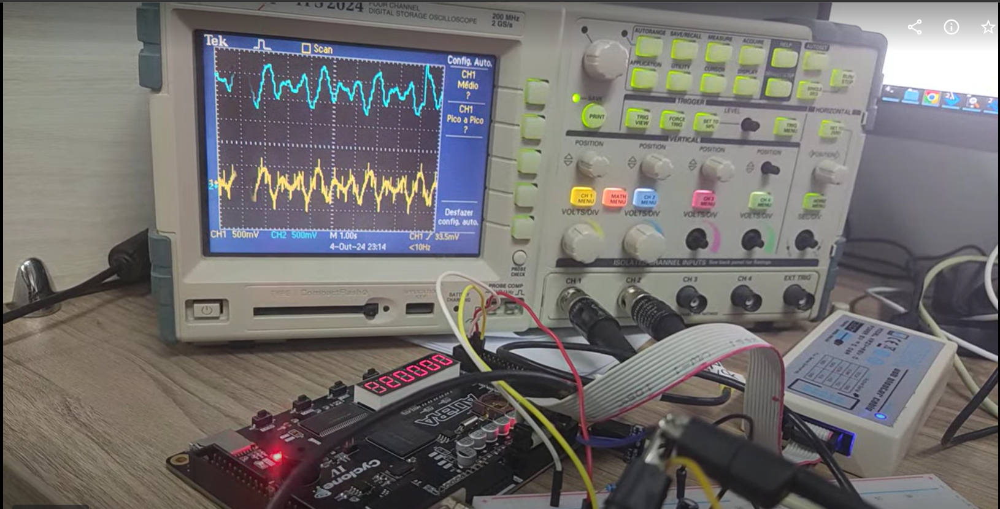

# Repositório dedicado à disciplina de Processamento Digital de Sinais

### **Objetivo do Projeto**        :  Implementação e verificação em hardware de um filtro de média móvel

### **Topológia do Filtro**        :  Cascaded Integrator–Comb Filter - CIC

### **Materiais Utilizados**     :  FPGA Cyclone IV, Resistores, Capacitores e um Osciloscópio.

### **Ferramentas**                :  Quartus prime II, Xcelium e o Simvision.

Estrutura do Projeto Os seguintes módulos foram implementados:

    AlinxModTest.sv -> Modulo topo Quartus Prime II
    
    divClock.sv     -> Divisor de frequência
    
    Integrator.sv   -> Integrador do filtro 
    
    Comb.sv         -> Diferenciador do filtro
    
    PWM.sv         -> Modulação PWM para dac
    
    ->sawtooth_wave.sv portadora
    
    ->cos_wave.sv      modulante
    
    filtro_em_cascata.sv -> Combinação do filtro.

FPGA usada

Observação: Devido à ausência de um conversor digital-analógico na FPGA, foi implementada uma solução utilizando modulação PWM acoplada a um circuito RC para reconstruir o sinal analógico associado.

A seguir, são apresentados os resultados obtidos:

Amarelo: Sinal de entrada Azul: Sinal de saída

Referências DSPRelated - Implementação de Filtros Referências:
https://www.dsprelated.com/showarticle/1337.php

